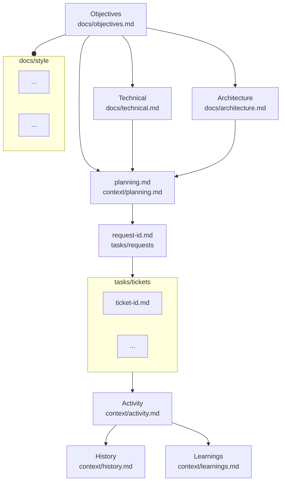
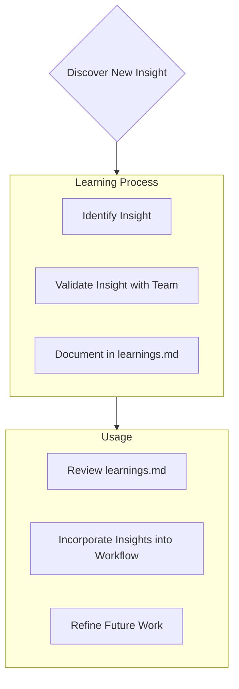

# Context

## Structure

The context structure is designed to provide a clear and organised way to document the project development activity. It consists of two main sections: **Project Files** and **Activity File(s)**. The Project Files are essential to maintain consistent, well-structured and well-executed plans, while the Context File(s) provide additional information that can be retrieved on demand as individual tasks require.



## Project Files

### 1. Project Objectives (@/docs/objectives.md)

- The reason this project exists
- Problems it solves
- Defines core requirements and goals
- Foundation document that shapes all other files
- Source of truth for project scope

### 2. System Architecture (@/docs/architecture.md)

- Functional relationships
- Component relationships
- Dependencies
- Data flows

### 3. Environment and Tech Stack (@/docs/technical.md)

- Technologies used
- Development setup
- Key technical decisions
- Design patterns in use
- Technical constraints
- Infrastructure
- Deployment

### 4. Project Features (@/docs/features.md)

- Non-technical elements
- User expectations and experience
- Designs and interfaces
- Feature implementation status

### 5. Project Management (@/tasks/index.md)

- In-depth tasks list and progress table
- Both open and completed requests and associated tickets
- Current status of each request
- Roadmap of planned work
- Known issues and other considerations

### 6. Request backlog (@/tasks/requests/)

- List of planned requests
- Each request has one or many tickets
- Requests are completed in order of dependency first, and priority second

### 7. Task backlog (@/tasks/tickets/)

- Each ticket is a single task to be completed
- Relates to a single request
- Tickets are completed in order of dependency first, and priority second

### 8. Learning Journal (@/tasks/context/learnings.md)

- Captures important patterns, pitfalls, and project intelligence
- Helps avoid repeating mistakes
- During LLM interaction, if a fix is found for a mistake in this project, or a reusable correction is received during a review or follow-up, you should document it in this file to avoid repeating the same mistake.

### 9. Style Guide - optional (@/docs/style/)

- Contains style guides for the project
- Coding standards
- Documentation standards
- Testing standards

## Active Context

### 1. Session Plan (@/tasks/context/planning.md)

- Derived from the context flow hierarchy
- Summarises the current request and the high-level plan to complete it
- Summarises the current ticket and the detailed plan to complete it
- (Usually) entirely created by the LLM using the `/project-manager` mode

### 2. Current State (@/tasks/context/activity.md)

- Summary of completed work
- Current work focus
- Active decisions and considerations
- Recent changes
- Next steps

### 3. Testing (@/tasks/context/testing.md)

- Records a summary of the testing strategy for the project
- Documents the testing framework and tools used
- Lists user stories and scenarios
- Provides a reference for future testing

### 4. History (@/tasks/context/history.md)

- Records a summary of all changes made to the project
- Provides a chronological view of project evolution

## Additional Context

Create additional files or folders as Memory files in docs/ or tasks/ when they help organise:

- Integration specifications
- Testing strategies
- Benchmarking setups
- Possible Extensions
- Deployment procedures

# Core Workflows

Always be aware of the mode the system is operating in, which is either a PLAN, ACT or REVIEW mode. The system will read and write to the memory files based on the current mode, and the mode should always be specified either by the user or based on the user input. The memory files are structured to support both planning and execution phases of the project, as well as review for further enhancements. Ask for the correct MODE if you are not 100% confident, and if in any doubt, ask explicitly.

## PLAN (Architect) Mode

```mermaid
flowchart TD
    Start[Start] --> ReadFiles[Read Core Files ("docs/": objectives.md, architecture.md, technical.md; "tasks/": context/planning.md, context/activity.md)]
    ReadFiles --> CheckFiles{Files Complete?}

    CheckFiles -->|No| Plan[Draft Plan]
    Plan --> DocumentChat[Discuss Plan in Chat]

    CheckFiles -->|Yes| VerifyContext[Verify Context]
    VerifyContext --> Strategy[Develop Strategy]
    Strategy --> Present[Present Strategy]

    Present --> Verification{Strategy Verified?}

    Verification -->|No| Clarify[Seek Clarification]
    Clarify --> Strategy[Develop Strategy]

    Verification -->|Yes| DocumentMemory[Update Core Files ("docs/": objectives.md, architecture.md, technical.md; "tasks/": context/planning.md, context/activity.md)]
```

## ACT (Code) Mode

```mermaid
flowchart TD
    Start[Start] --> Context[Review Core Files ("docs/": objectives.md, architecture.md, technical.md; "tasks/": context/planning.md, context/activity.md)]
    Context --> Execute[Execute Task]
    Execute --> Validate[Validate Changes]
    Validate -->|Pass| Document[Document Task Completion in context/activity.md]
    Validate -->|Fail| Debug[Debug and Retry]
```

## REVIEW Mode

```mermaid
flowchart TD
    Start[Start] --> ReviewFiles[Review Core Files ("docs/": objectives.md, architecture.md, technical.md; "tasks/": context/planning.md, context/activity.md)]
    ReviewFiles --> IdentifyGaps{Identify Gaps?}

    IdentifyGaps -->|Yes| UpdateDocs[Update Documentation]
    IdentifyGaps -->|No| Approve[Approve Current State]

    UpdateDocs --> VerifyUpdates[Verify Updates]
    VerifyUpdates --> Approve
```

# Documentation Updates

Documentation should only be updated outside of ACT (Code) mode. Updates occur during planning or dedicated documentation tasks. On rare occasions, updates may be made if shortfalls in existing documentation are uncovered, but only with explicit approval.

```mermaid
flowchart TD
    Start[Start Update Process]

    subgraph Process
        P1[Review Core Files ("docs/": objectives.md, architecture.md, technical.md; "tasks/": context/planning.md, context/activity.md)]
        P2[Identify Gaps or Shortfalls]
        P3[Draft Updates]
        P4[Verify Updates with Approval]
        P5[Apply Updates to Core Files]

        P1 --> P2 --> P3 --> P4 --> P5
    end

    Start --> Process
```

Note: Documentation updates must be deliberate and approved, ensuring alignment with project goals and avoiding unnecessary changes during active development.

# Project Intelligence (tasks/context/learnings.md)

The `tasks/context/learnings.md` file serves as the project's learning journal. It captures critical patterns, preferences, and project intelligence to improve future work. This document evolves as the project progresses, ensuring that key insights are preserved.



## What to Capture

- Critical implementation paths
- User preferences and work flows
- Project-specific patterns
- Challenges and their solutions
- Evolution of design decisions
- Effective tool usage strategies

The `tasks/context/learnings.md` file is a living document, growing smarter with each iteration to support both human developers and LLMs in achieving project goals.
